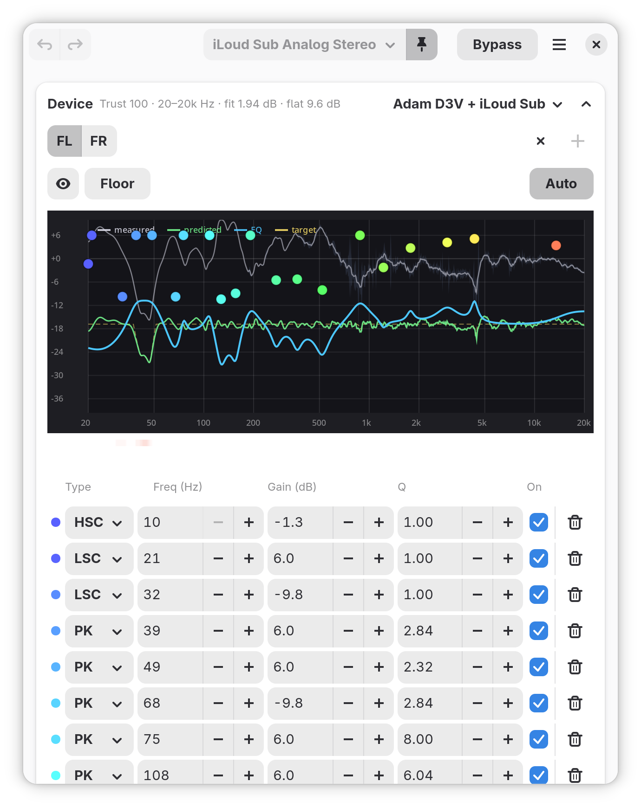
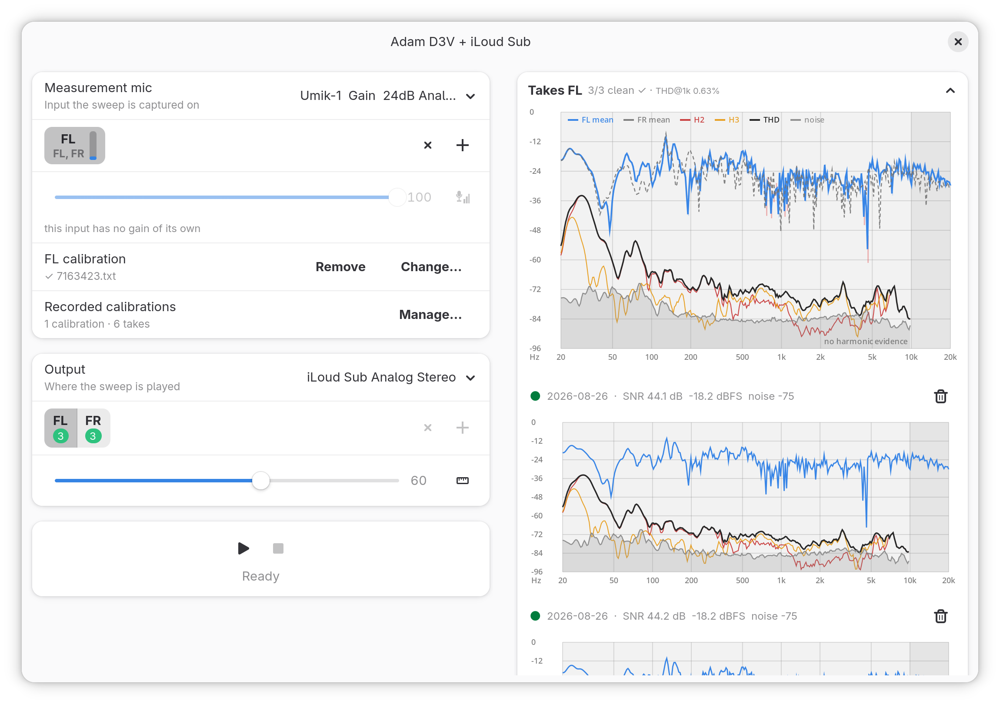

🇷🇺 Читайте инструкцию на русском: [README.ru.md](README.ru.md)

# per-device-eq — measure and correct any output device, inside PipeWire

`per-device-eq` measures your speakers, headphones or IEMs with your own
measurement rig, fits a parametric EQ to the result, and applies it as an
in-node filter-graph **directly inside the real sink** — no virtual sink, no
extra node, no background process. A small WirePlumber hook re-applies the
correction whenever the device starts playing, so it survives reboot, hotplug
and Bluetooth reconnect with nothing of yours running.

On top of the per-device correction sits a **taste layer**: your personal EQ,
composed after whatever profile is active, on every device, without ever
touching the measured profiles.





Projects like REW, AutoEq and EasyEffects inspired this one with the results
they achieve; I wanted the same correctness with more comfort, so the whole
loop — measure, fit, apply, keep — lives in one app.

How the fit thinks — the gold target it lawfully aims at, why that target
is not a straight line, and the full mathematics of the solver — lives in
[SOLVER.md](SOLVER.md). What a measurement must earn before the fit will
trust it — the score, the controlled band, and why a single sweep earns
nothing — lives in [TRUST.md](TRUST.md).

### What per-device-eq gives you

- **Built-in measurement.** Sweep generation, capture, per-capsule mic
  calibration, take averaging and a constrained parametric fit — the app is
  the instrument. No external measurement software involved.
- **Incremental takes.** Every accepted sweep is persisted the moment it
  lands. Add takes across sessions, delete a bad one, re-fit — the profile
  only improves.
- **Distortion on the record.** Every take stores its harmonics and its
  own noise floor, drawn per take and summed into a warning band under
  the correction, so a boost that would be heard as rasp is visible
  before you reach for it.
- **Per output device.** Each sink — built-in speakers, HDMI, a specific
  Bluetooth headset (by MAC) — remembers its own EQ and gets it back
  automatically.
- **Taste, separated from correction.** Named preference layers
  ("Basshead", one per listener on a shared machine) ride over any profile
  and never flip a profile's `edited` mark.
- **Honest headroom.** A shared preamp with a Safe suggestion computed over
  the *composition* (profile + taste), a live post-EQ meter, and a fit that
  lands gain-staged instead of clipping.
- **Interactive editor.** Drag bands on the response graph, per-channel EQ,
  bypass A/B, Undo/Redo (`Ctrl+Z` / `Ctrl+Shift+Z`), trust plaque with
  one-click Re-fit.

---

## Requirements & install

### AppImage (any distro with PipeWire)

Grab `PerDeviceEQ-<version>-x86_64.AppImage` from the
[releases page](https://github.com/NTMan/PerDeviceEQ/releases),
make it executable and run it -- no root, no install:

    chmod +x PerDeviceEQ-*-x86_64.AppImage
    ./PerDeviceEQ-*-x86_64.AppImage

The bundle carries Python, GTK 4 and libadwaita; PipeWire's
own client tools (`pw-dump`, `pw-cat`) come from your distro,
as on every PipeWire desktop. Floor: glibc 2.42 -- Fedora
43+, Ubuntu 25.10+/26.04 LTS, and any rolling distro (Arch,
Gentoo, openSUSE Tumbleweed) qualifies by nature; Debian 13
and Mint 22 sit below the floor and are out until a
source-built-stack build on an older base earns its keep. The
build base tracks the oldest supported Fedora. The `.zsync`
file next to it is the auto-update channel for
AppImageUpdate.

**PipeWire ≥ 1.6** (the in-node `audioconvert.filter-graph` is required),
**WirePlumber**, **GTK 4** with **libadwaita ≥ 1.6**, **PyGObject**,
**PyCairo**, **Python 3**. Measuring and the live meter additionally need
**python3-numpy**, **python3-scipy** and **python3-soundfile**. At runtime
the app also calls `pw-metadata` and `pw-dump`; if either is missing it says
so on launch.

### Fedora (COPR) — recommended

```
sudo dnf copr enable mikhail/per-device-eq
sudo dnf install per-device-eq
```

This installs the `per-device-eq` launcher, the WirePlumber hook (under
`/usr/share/per-device-eq/`), and the desktop entry + icon. Start it from
your application menu as **Per-Device EQ**, or run `per-device-eq`. On first
launch the app asks to install its WirePlumber hook into your user
session (restarting WirePlumber once); remove everything later with
`per-device-eq --uninstall`. After that the EQ is restored automatically on
every reboot and reconnect.

### The hook outlives the package

Removing the package (`dnf remove per-device-eq`,
`flatpak uninstall io.github.ntman.PerDeviceEQ`) does NOT remove
the per-user hook: an RPM must not touch user homes, and Flatpak
has no uninstall scripts at all -- this is platform design, and
it is the same for both. Remove the integration BEFORE removing
the package (*Remove integration* in the main menu, or
`--uninstall`). If the package is already gone, the hook keeps
applying the last EQ; both installed files carry these removal
instructions in their headers:

```
rm ~/.local/share/wireplumber/scripts/90-per-device-eq.lua
rm ~/.config/wireplumber/wireplumber.conf.d/90-per-device-eq.conf
systemctl --user restart wireplumber
```

### Run from source

```
# Fedora; other distros ship the same tools under different package names:
sudo dnf install gtk4 libadwaita python3-gobject python3-cairo \
    python3-numpy python3-scipy python3-soundfile \
    pipewire pipewire-utils wireplumber
git clone https://github.com/NTMan/PerDeviceEQ.git
cd per-device-eq
chmod +x per-device-eq.py
./per-device-eq.py
```

To install the system integration from a checkout -- the WirePlumber
hook plus the menu entry and icon (reversible; writes only under
`~/.local` and `~/.config`):

```
./per-device-eq.py --install
./per-device-eq.py --uninstall
```

### Build the RPM yourself

The repository ships a `per-device-eq.spec`. To build it locally on Fedora:

```
sudo dnf install rpm-build rpmdevtools desktop-file-utils libappstream-glib
rpmdev-setuptree
git archive --format=tar.gz --prefix=per-device-eq-1.0.0/ \
    -o ~/rpmbuild/SOURCES/per-device-eq-1.0.0.tar.gz v1.0.0
rpmbuild -ba per-device-eq.spec
```

### Flatpak

Planned. A Flatpak has to bridge the WirePlumber hook out of the sandbox, so
it needs extra plumbing; until then, COPR is the turnkey route on Fedora.

---

# Measuring a device

You need a measurement rig the device can play into: an ear/headphone rig
(miniDSP EARS or a 711-class coupler) for headphones and IEMs, or a USB
measurement mic for speakers, plus its per-capsule calibration files.

Mount the device on the rig, then open the profile picker on the output
you are correcting and press **+** (New) — editing an existing profile
opens the same window on the profile's *own* device. The window is read
top to bottom, and that order is a dependency rather than a habit: the
microphone is settled first and needs to know nothing about what will be
played; the target comes second, because without one there is nothing to
play to; the level comes last, when both ends exist. Nothing is guessed
on your behalf, and every answer is remembered, so the next profile
measured on the same bench starts at step 4.

1. **Pick the measurement mic** in *Measurement mic* — the input the
   sweep is captured on.
2. **Declare the capture channels it has.** Press **+** on the strip: a
   rig has the channels a hand declared and no others. Each one carries
   its own **calibration** file (*Change…*), and the bar on its tab is
   live — knock on a capsule and the tab it arrives on moves, which is
   how you tell which is which without unplugging anything.
3. **Calibrate the sensitivity.** The button beside the gain fader walks
   that input's gain **in silence** — nothing is played — and finds the
   point where the microphone's own noise stops being buried in the
   converter's. Below it signal-to-noise is being thrown away; above it
   more gain buys nothing and costs headroom. An input with no analogue
   gain of its own, like a UMIK-1, says so under the fader and skips
   this step.
4. **Pick the output** in *Output* — where the sweep is played.
5. **Declare the channels to measure.** **+** offers the sink's
   channels, and then which capsule captures each one. With a single
   capsule in use there is nothing to answer: it captures every target,
   and each capsule's tab prints what it captures. With two, the submenu
   carries a live level per capsule, so the answer is a knock and a
   click.
6. **Calibrate the level.** The first **play** on a rig the app has not
   seen hunts the playback level itself with probe sweeps — hot enough
   for a clean take, safely short of clipping — and refuses honestly if
   no level can be both. It is one number for the whole rig, not one per
   channel; the fader shows it, and the button beside it forgets the
   remembered value and measures it here and now.
7. **Land about three clean takes per channel.** A green dot marks a
   clean take. Re-seat the device between takes: the take-to-take spread
   is what tells the fit which frequencies to trust. Every take is saved
   the moment it completes, and the trash can on a take removes it.

The card above the takes shows the channel's mean response with the
spread band; the **EQ range** handles below it follow the trustworthy
band until you drag them, and **Bands** sets the fit's filter budget.
Close the window and the fit runs right on the main window's graph with
a per-channel progress bar, lands gain-staged (Safe preamp), and the
profile is playing. The trust plaque under the graph offers **Re-fit**
after you add or remove takes later.

### Distortion, and the Floor

A take records more than the response. It confesses the second and third
harmonic, the total harmonic distortion and the noise the room and the
chain contributed; they are drawn under the response in the takes list
and summarised in the panel's header as `THD@1k`. Where a harmonic falls
outside the sweep the pen stops instead of guessing, and the graph says
*no harmonic evidence* over that region.

The **Floor** is a high-pass under the correction, the answer to a woofer
asked for excursion it does not have — where more bass buys distortion
rather than bass. Its handle carries a warning band along the top of its
own strip: one curve for the whole profile, the worst channel at each
frequency, painted where the measured distortion passes the point at
which it is heard. That threshold moves with frequency, because hearing
does — roughly −18 dB re the tone at 20 Hz against −40 dB from 1 kHz up.
Whole percents pass unnoticed in the bass; tenths of one do not in the
midband. A profile whose takes carry no confession is painted not at
all: an absence of evidence and an absence of distortion must not wear
the same colour.

### Speakers with a UMIK-1

Measure at the listening position with the mic at ear height. miniDSP
ships two calibration files per unit and they are not interchangeable:
each corrects the capsule for ONE incidence angle, and the difference
lives in the treble, where the capsule stops being omnidirectional.
This flow drives one speaker per sweep, so for a stereo pair point the
mic **at the active speaker** and load the **0°** file: the direct
on-axis sound is what the correction acts on, and 0° is the curve
measured individually for your unit. For a multichannel rig point the
mic **at the ceiling** with the **90°** file: with speakers all around
there is no on-axis to aim at, and a vertical mic meets every
horizontal arrival at the same 90°, one geometry for every channel.
Below the room transition (roughly 200 Hz) the files coincide, so none
of this matters for bass. "Reseat between takes" still means moving
the mic a hand's width around the seat.

### Taste: your EQ over every device

The gear in the header opens **Preference EQ layers**: named, hand-dialed
EQs composed after the active profile on *every* device. The **Taste** row
above Profile switches the active layer in one click — handy when two
people share the machine. Layers never modify the measured profiles, and
the headroom hints account for the composition, so a bass shelf on top
cannot clip behind the meter's back.

### Everyday use

- **Profile picker:** switch the profile bound to the current device;
  **+** measures a new one, the folder icon imports a profile shared by
  someone else. `Default (no EQ)` means flat.
- **Bypass** to A/B against the uncorrected sound (runtime only).
- **Tune by hand:** drag a point on the graph to move a band, click empty
  space to add one, right-click to remove; or edit the table. Hand edits
  mark the fit `edited`; Re-fit offers to discard them. Prefer making
  taste adjustments in the **Taste** layer, not in the device correction:
  corrections stay measured, and every device keeps sounding equally
  right.
- **Per-channel EQ:** every channel the output has gets its own tab and
  its own curve. A profile that holds a single channel is a single curve
  and plays on all of them.

---

## Command line

```
./per-device-eq.py --list-sinks      # list sinks (default marked with *)
./per-device-eq.py --list-sources    # list capture sources
./per-device-eq.py --list-profiles   # list profiles and their device bindings
./per-device-eq.py --inspect NAME    # dump a sink's params (node.name)
./per-device-eq.py --apply           # apply each bound profile to its sink now
./per-device-eq.py --install         # install the hook + desktop integration
./per-device-eq.py --uninstall       # remove the hook + desktop integration
```

## Files

| Path                                                             | What                                                                     |
| ---------------------------------------------------------------- | ------------------------------------------------------------------------ |
| `~/.config/per-device-eq/profiles/*.json`                        | your profiles (bands, takes, fit metadata)                               |
| `~/.config/per-device-eq/preference-layers.json`                 | the taste layers and which one is active                                 |
| `~/.config/per-device-eq/bindings.json`                          | per device (`node.name`): its profile, and which profile channel feeds which of its own |
| `~/.local/share/wireplumber/scripts/90-per-device-eq.lua`        | the persistence hook (a static script, installed verbatim from the repo) |
| `~/.local/state/wireplumber/per-device-eq`                       | the hook's saved graphs (written by the hook; restored at startup)       |
| `~/.config/wireplumber/wireplumber.conf.d/90-per-device-eq.conf` | loads the hook and creates the `per-device-eq` metadata object           |
| `profiles/clean.json`, `/usr/share/per-device-eq/profiles/`      | built-in / system profiles                                               |

## Development: audit tools & tests

The `tools/` directory contains the measurement/clipping audit toolkit; the
development plan lives in [ROADMAP.md](ROADMAP.md).

| Tool                      | Purpose                                                                    |
| ------------------------- | -------------------------------------------------------------------------- |
| `perdeviceeq/pde_audit.py`| shared RBJ biquad library, clip statistics, demo profile                   |
| `tools/audit_peaks.py`    | peak / clip counter for float32 captures                                   |
| `tools/audit_headroom.py` | pre-EQ capture × profile → post-EQ peak, clip count, recommended preamp    |
| `tools/make_fixtures.py`  | deterministic clean/hot-master test fixtures (seed-pinned)                 |

### Capturing audio for audits

The sink monitor taps **pre-EQ** in the in-node topology, so a capture shows
what *enters* the EQ; `audit_headroom.py` computes what *leaves* it:

```
pw-record -P '{ stream.capture.sink = true }' \
          --target <sink-name> --format f32 capture.wav
```

`--format f32` is mandatory — integer formats destroy over-full-scale peaks
at write time, and those peaks are the whole point of the audit. Real
captures (including copyrighted material) belong in `tests/fixtures-local/`
(gitignored), never in the repository.

### Tests

```
python3 -m pytest tests/
```

Fixtures are generated on the fly by `tests/conftest.py` — deterministic and
seed-pinned, so no binary test data is stored in git.

## Known issues

- **Volume drop after enabling EQ -- fixed in PipeWire 1.6.8.** On sinks
  with hardware volume, the first volume change made *after* an in-node
  EQ was active could collapse the real output level while the reported
  volume looked correct: the filter-graph ate the softVolume/softMute
  properties instead of passing them through, so channel volumes applied
  twice, in hardware and again in software. Fixed upstream in **1.6.8**
  (<https://gitlab.freedesktop.org/pipewire/pipewire/-/work_items/5344>);
  on 1.6.7 and older, set the volume before enabling the EQ, or
  `systemctl --user restart wireplumber`.
